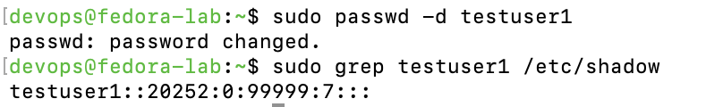
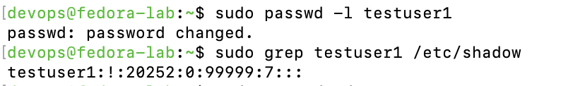
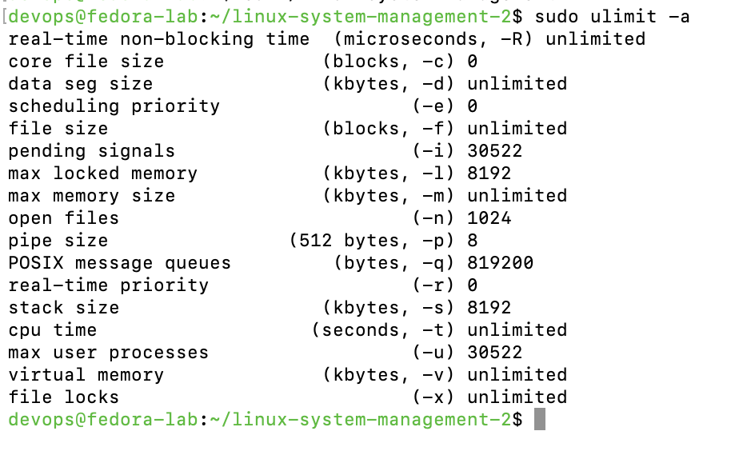
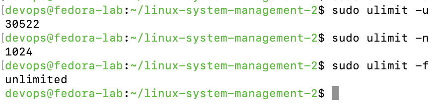
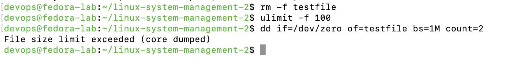
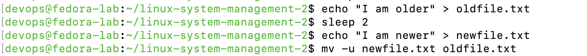
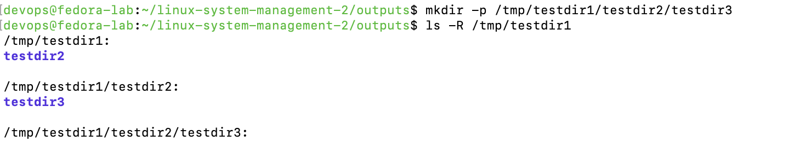

# 🔐 linux-system-management-2

> **Project 2 of 3** in the Linux System Management series  
> Focus: Shadow file, user states, password locks, ulimit, and file ops

---

## 📌 Objectives

- Understand Linux user authentication and shadow file structure
- Analyze locked, disabled, and unset passwords in `/etc/shadow`
- Practice safe file operations using `mv -u` and `mkdir -p`
- Configure and verify user limits with `ulimit`

---

## 📁 Project Structure

```
linux-system-management-2/
├── README.md
├── outputs/
│   ├── 01a-shadow-passwd-d.txt
│   ├── 01b-shadow-passwd-l.txt
│   ├── 02-ulimit-output.txt
│   ├── 02b-ulimit-focused.txt
│   ├── 02c-ulimit-test-dd.txt
│   ├── 03-mv-test-output.txt
│   └── 04-mkdir-test-output.txt
└── screenshots/
    ├── 01a-passwd-d-shadow.png
    ├── 01b-passwd-l-shadow.png
    ├── 02-ulimit-output.png
    ├── 02b-ulimit-focused.png
    ├── 02c-ulimit-test-dd.png
    ├── 03-mv-test-output.png
    └── 04-mkdir-test-output.png
```

---

## ⚙️ Command Execution & Results

### 1️⃣ Examine `/etc/shadow` Password States

```bash
# Create user and remove password
sudo useradd testuser1
sudo passwd -d testuser1
sudo grep testuser1 /etc/shadow

# Lock the user account
sudo passwd -l testuser1
sudo grep testuser1 /etc/shadow
```

📄 [`01a-shadow-passwd-d.txt`](outputs/01a-shadow-passwd-d.txt)  
📄 [`01b-shadow-passwd-l.txt`](outputs/01b-shadow-passwd-l.txt)  

📷   
📷 

---

### 2️⃣ Set and View `ulimit` Resource Limits

```bash
ulimit -a
ulimit -u
ulimit -n
```

📄 [`02-ulimit-output.txt`](outputs/02-ulimit-output.txt)  
📷   
📷 

---

### 🧪 Deep Dive: Enforcing File Size Limit with `ulimit -f`

To simulate a file size enforcement scenario, I temporarily limited the shell's max file size:

```bash
ulimit -f 100
dd if=/dev/zero of=testfile bs=1M count=2
```

📸 

> ✅ This triggered the expected failure:  
> `File size limit exceeded (core dumped)`

Restored default limit afterward:

```bash
ulimit -f unlimited
rm -f testfile
```

---

### 3️⃣ Test `mv -u` (Move if Newer)

```bash
echo "I am older" > oldfile.txt
sleep 2
echo "I am newer" > newfile.txt
mv -u newfile.txt oldfile.txt
cat oldfile.txt
```

📄 [`03-mv-test-output.txt`](outputs/03-mv-test-output.txt)  
📷 

> ✅ Confirmed that the content of `oldfile.txt` was replaced only because `newfile.txt` was newer.

---

### 4️⃣ Test `mkdir -p` (Recursive Directory Creation)

```bash
mkdir -p /tmp/testdir1/testdir2/testdir3
ls -R /tmp/testdir1
```

📄 [`04-mkdir-test-output.txt`](outputs/04-mkdir-test-output.txt)  
📷 

> ✅ Demonstrated ability to create nested directory trees in a single command.

---

## ✅ Summary

This project reinforces Linux+ exam skills around user account management, shadow file analysis, and essential file operations.  
Screenshots and command outputs offer a complete trace of each concept in practice.

---

## 🧠 Next Project

→ [linux-system-management-3](https://github.com/carlos-tech-ops/linux-system-management-3)  
Focus: SSH, PXE, DNS, name resolution, and network boot behavior
